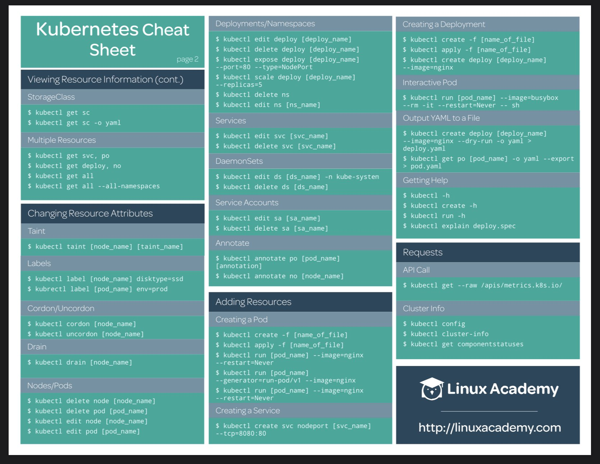
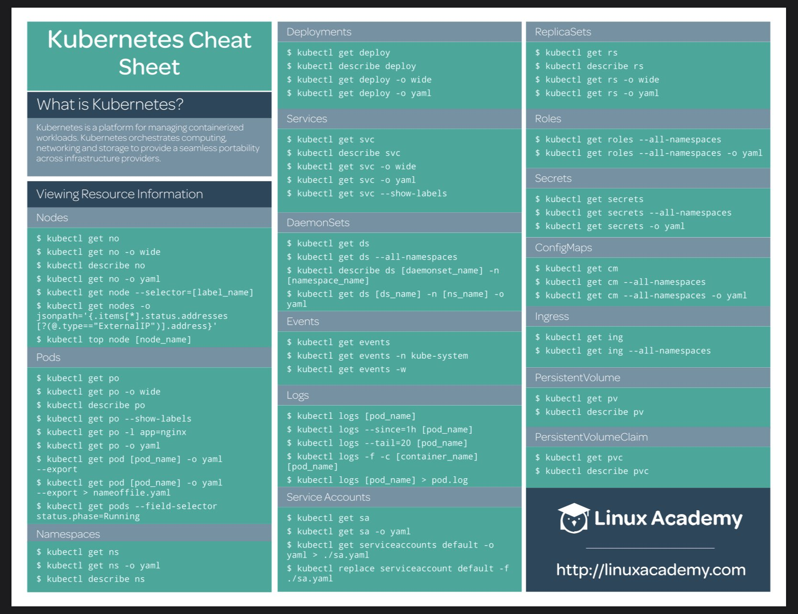

## Kubernetes

Stockage de liens de sources et/ou d'outil pour l'éco système kubernetes

https://kubernetes.io/docs/tutorials/stateless-application/expose-external-ip-address/

https://learnk8s.io/troubleshooting-deployments

https://kubernetes.io/docs/tasks/configure-pod-container/translate-compose-kubernetes/

https://tutorials.ubuntu.com/tutorial/install-a-local-kubernetes-with-microk8s

https://codeburst.io/getting-started-with-kubernetes-deploy-a-docker-container-with-kubernetes-in-5-minutes-eb4be0e96370

https://k33g.gitlab.io/articles/2020-02-21-K3S-02-FIRST-DEPLOY.html

https://redhat-developer-demos.github.io/kubernetes-tutorial/kubernetes-tutorial/index.html

https://dev.to/aurelievache/kubernetes-sketchnotes-10-liveness-readiness-probes-160g

Outils : kubectx, kubens, k9s, kube-dev (relferreira/kubedev)

